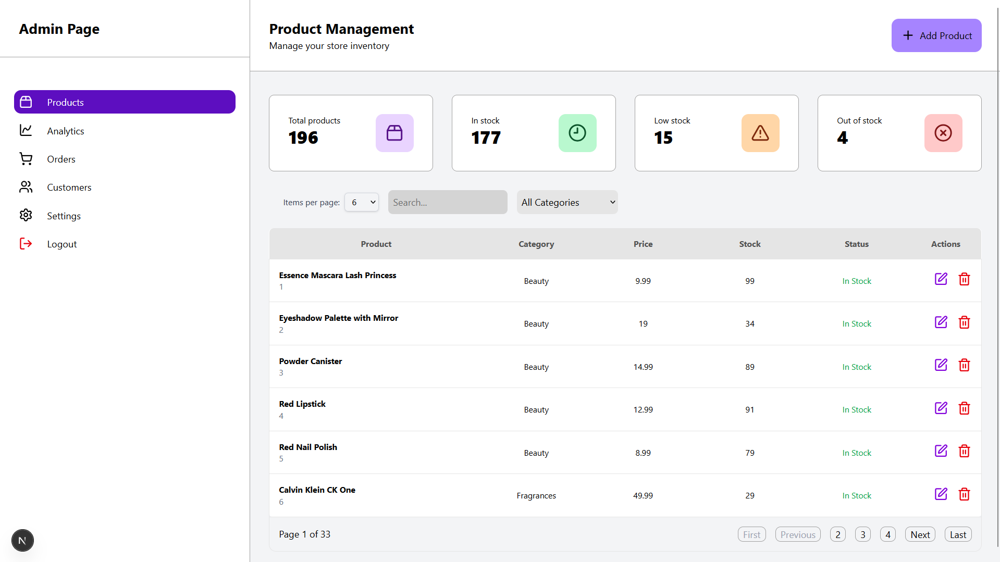
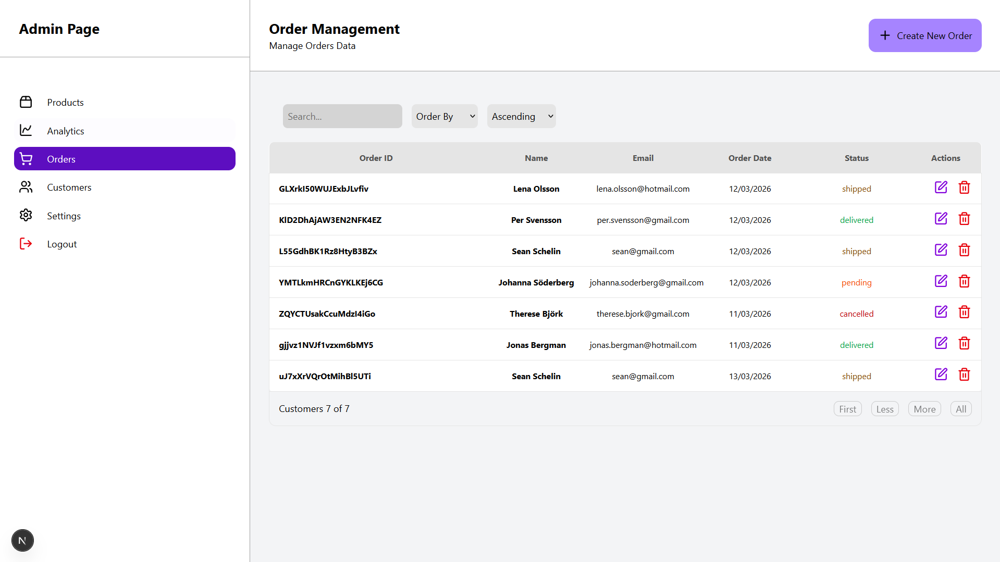
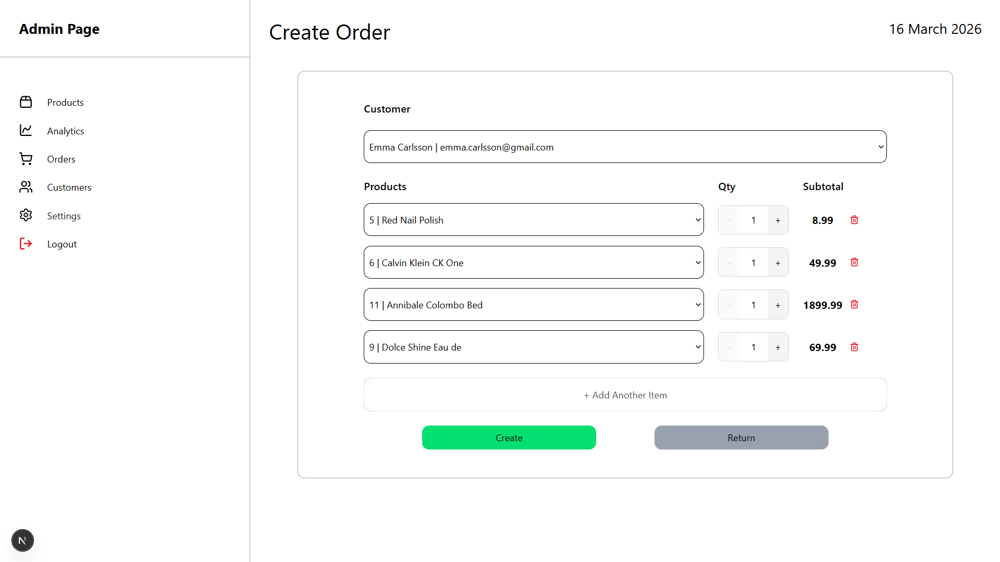

# Webstore Admin Dashboard

A web store admin dashboard built with **Next.js 16**, **TypeScript**, and **Tailwind CSS v4**. Browse a product catalogue, filter by category, sort by price or title, and paginate through results, all state driven entirely by the URL.

---

## Personal Reflection

I built this project to deepen my understanding of Next.js and its core features. My two main areas of focus were:

1. **URL-driven state management** — Rather than relying on `useState` or a client-side state library, I deliberately chose to represent all UI state (sorting, filtering, pagination, etc.) in the URL via `searchParams`. This keeps the application shareable and bookmarkable, and forces a clean separation between what drives the UI and how it is rendered.

2. **React Server Components** — I leaned into Next.js's server-first model and kept as much rendering on the server as possible, only dropping into client components where user interactivity demanded it.

I also used the project as a hands-on opportunity to work with two different data sources: a `json-server` mock REST API (with custom middleware) and Firebase / Firestore (for persisting Orders and Customers, and handling admin authentication).

> **Known limitations:** error handling is minimal and the category-filtering logic has some bugs. The goal was deliberate practice on state management and data-fetching patterns, not a production-ready product.

---

## Features

- 🛍️ **Product catalogue** - browse products fetched from a mock REST API
- 👥 **Customer catalogue** - browse customers fetched from Firestore
- 🧾 **Orders cataologue** - browse through all orders fetched from Firestore
- 🔍 **Filtering** - filter products by category
- ↕️ **Sorting** - sort by price or title, ascending or descending
- 📄 **Pagination** - navigate through pages of results
- 🔢 **Configurable page size** - choose how many products to display at once
- 🔗 **URL-driven state** - all filter, sort, and pagination state lives in the URL
- 🛠 **CRUD Operations** - create, read, update and delete customers, products and objects

---

## Tech Stack

| Technology | Purpose |
|---|---|
| [Next.js 16](https://nextjs.org/) | Full-stack React framework (App Router) |
| [TypeScript](https://www.typescriptlang.org/) | Type safety across the codebase |
| [Tailwind CSS v4](https://tailwindcss.com/) | Utility-first styling |
| [Firebase / Firestore](https://firebase.google.com/) | Persistent storage for Order and Customer objects. Admin Authentication and Authorization via Firebase auth |
| [json-server](https://github.com/typicode/json-server) | Mock REST API with custom middleware |
| [Biome](https://biomejs.dev/) | Linting and formatting |
| [Lucide React](https://lucide.dev/) | Icon library |

---

## Screenshots






---

## Getting Started

### Prerequisites

- [Node.js](https://nodejs.org/) 18 or later
- npm

### Installation

```bash
# Clone the repository
git clone <your-repo-url>
cd Practice-Store

# Install dependencies
npm install
```

### Environment Variables

Copy `.env.development` and fill in your Firebase credentials before running the app.

### Running Locally

```bash
# Start Next.js dev server + mock REST API (json-server) concurrently
npm run dev:full
```

Open [http://localhost:3000](http://localhost:3000) in your browser.

### Other Useful Scripts

| Script | Description |
|---|---|
| `npm run dev` | Next.js dev server only |
| `npm run dev:full` | Next.js dev server + mock REST API (json-server) concurrently |
| `npm run mock-server` | json-server mock API only (port 4000) |
| `npm run build` | Production build |
| `npm run lint` | Lint with Biome |
| `npm run format` | Auto-format with Biome |

---
